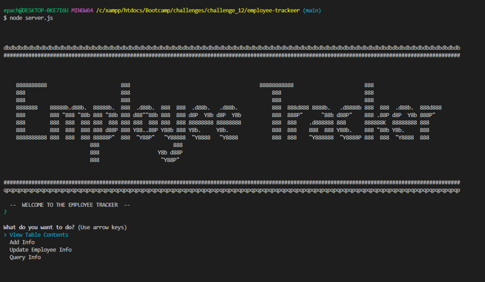
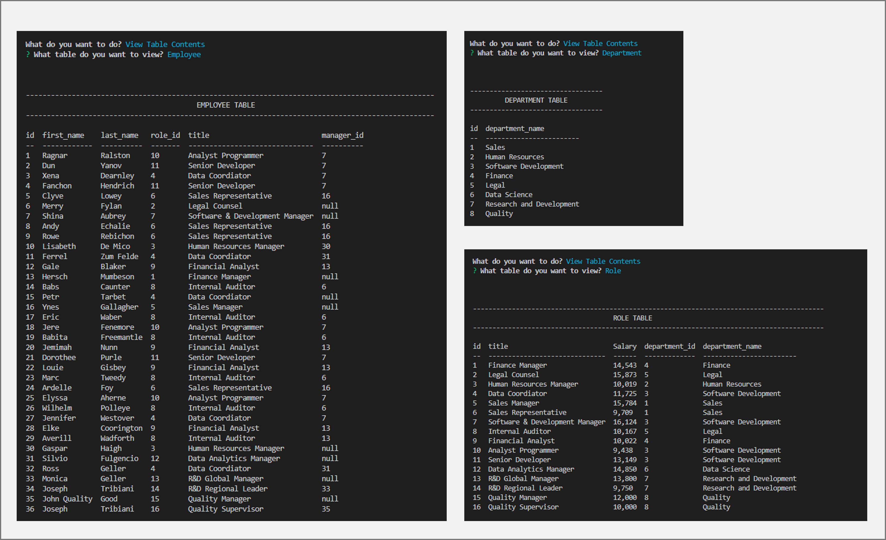
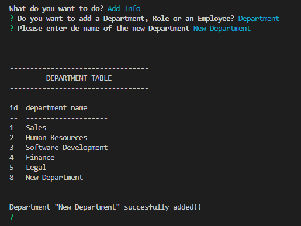
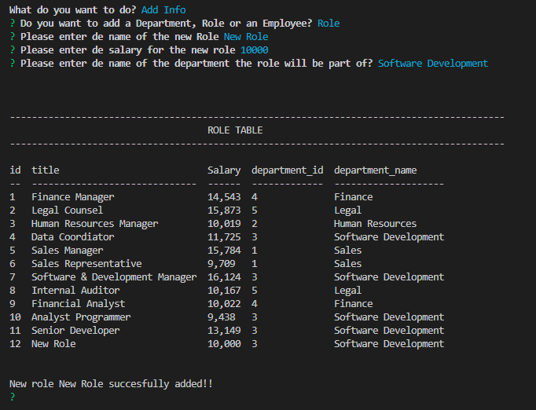
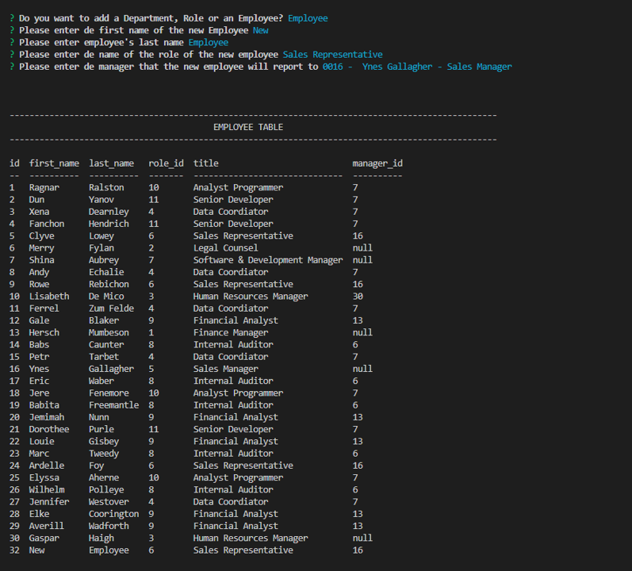
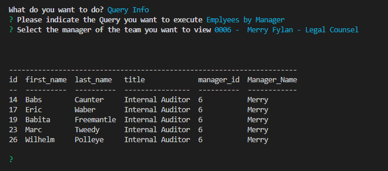
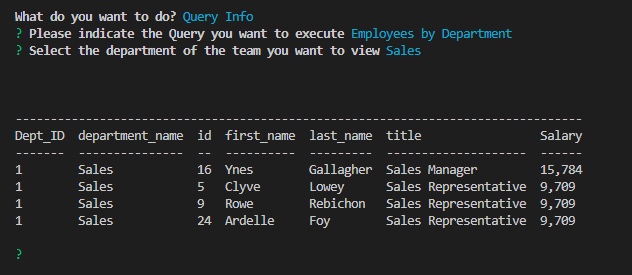
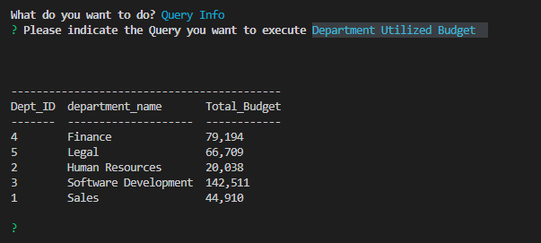

# Employee Tracker (SQL App)  

## Table of Contents
- [Description](#description)
- [Usage](#usage)  
- [Questions](#questions)  
  

## Description  

Employee Tracker is a simple SQL app which keeps information of Departents, Roles and Employees for a company. with this information the user is allower to do the following actions:
- View contents of Repartment, Roles and Employees tables.
- Add information to the data base tables.
- Perform pre-defined cross-information queries.

  

## Usage  

The Employee Tracker allows the user to perform queries, add and modify questions.

The app starts prompting the user to select 4 main functions

- View Table Contents
- Add Info
- Update Employee Info
- Query Info

*For more detailed information and a walkthrough the code and app funcionality, please refer to the following video
[Walk Through Code & Functionality](https://watch.screencastify.com/v/pEwS5DVglbbadxlnkTMR)

### VIEW TABLE CONTENTS  

Select the table for which you want to view the content:
- Department
- Role
- Employee

After user makes a selection the app will show the contents of the selected table. 

### ADD INFO
Employe tracker apps allows users to add records on each table. After selecting the Add Info option the app will prompt for the table in which info will de added.

Depending on the selection, the app will ask for the following info

DEPARTMENT:
- Enter the name of new department

ROLE:
- Entert the name of new Role
- Enter the salary for the new role
- App will show a list of current departments so the user selects an existing department

EMPLOYEE
- Enter employee first name
- Enter employee last name
- App will show a list of current roles so the user selects an existing role
- App will show a list of current managers so the user selects an existing Manager. However, if the new employee is intended to be a manager, the user shall use the option 'MNGR  -->  ADD AS MANAGER <--'

### UPDATE EMPLOYEER INFO
The user is allowed to change either the role of the employee or the manager the selected employee reports to.

As a first step the app will show the list of current employees, so that the user choses whose information will be changed.

After that, the user will be presented a list of current roles/managers; a role/manager must be selected and the employee info will be updated to that information.

### QUERY INFO

The employee tracker app offers three pre-defined cross-info reports the user can choose:

EMPLOYEES BY MANAGER
User shall select the MANAGER for which the user wants to know the employees that report to the selected manager.

EMPLOYEES BY DEPARTMENT
User shall select the DEPARTMENT for which the user wants to know the employees that belong to the selected department.

DEPARTMENT UTILIZED BUDGET  
Shows all the departments and the sum of the salaries of all the employees that belongs to each department

## Questions
Please refer to my GitHub profile for more information: https://github.com/Lalo79  
If you have questions, you can reach me via e-mail: lalo@mail.com   

